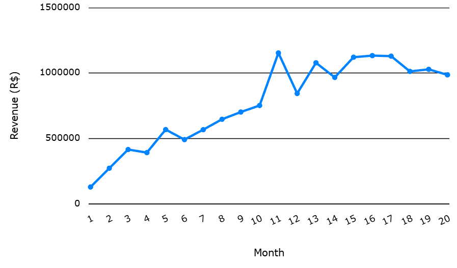
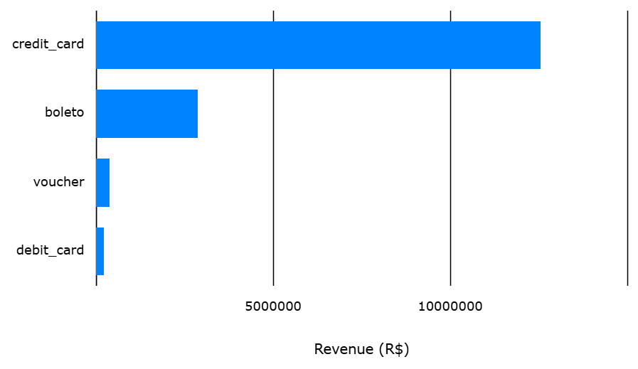

# Olist E-Commerce Analysis

**Team:** Michael Amaya, Vanessa Quiroz, Jan Zika
**Course:** Azure + T-SQL Database Analysis
**Topic:** Sales performance and customer behavior in a large e-commerce marketplace

---

## About the Dataset

This project uses the [Olist E-Commerce Dataset](https://www.kaggle.com/datasets/olistbr/brazilian-ecommerce), a real Brazilian e-commerce dataset covering 2016–2018. It contains orders, customers, sellers, products, payments, reviews, and marketing leads across 11 tables and ~1.56 million rows.

| Table | Rows | Description |
|---|---|---|
| orders | 99,441 | Order headers with status and timestamps |
| order_items | 112,650 | Line items per order |
| order_payments | 103,886 | Payment method and installments |
| order_reviews | 99,224 | Customer review scores and comments |
| customers | 99,441 | Customer location data |
| sellers | 3,095 | Seller location data |
| products | 32,951 | Product dimensions and category |
| product_category_name_translation | 71 | Portuguese → English category names |
| geolocation | 1,000,163 | ZIP code lat/lng lookup |
| leads_qualified | 8,000 | Marketing qualified leads |
| leads_closed | 842 | Converted leads |

---

## Analysis Goals

### Jan Zika — Sales & Revenue
- How has revenue trended over time?
- Which payment methods are most popular, and what is the average installment count?
- Which states generate the highest average order value?
- Which product categories drive the most revenue?

### Michael Amaya — Customer & Delivery Behavior
- How often are orders delivered on time vs late?
- What is the distribution of customer review scores?
- How many customers have placed more than one order?
- What is the breakdown of orders by status?

### Vanessa Quiroz — Seller & Product Performance
- Who are the top-performing sellers by revenue?
- Which product categories are most popular by volume?
- What does the marketing lead conversion funnel look like?
- Is there a correlation between freight cost and product weight?

### Bonus — Geolocation Analysis (Jan Zika)
- Which seller-to-customer city routes handle the most orders?
- Does freight cost increase with distance?
- Introduces `vw_geo`: a reusable view that deduplicates the geolocation table and pre-computes seller-to-customer distance per order

---

## Repository Structure

```
queries/
  01_queries_jan.sql       -- Sales & Revenue (Jan Zika)
  02_queries_michael.sql   -- Customer & Delivery (Michael Amaya)
  03_queries_vanessa.sql   -- Seller & Product Performance (Vanessa Quiroz)
  04_queries_bonus.sql     -- Geolocation analysis via vw_geo (Jan Zika)

visualizations/
  README.md                -- Visualization descriptions
  *.png                    -- Exported charts
```

---

## Database Setup

The dataset is hosted on **Azure SQL Database**. See [DATABASE_SETUP.md](DATABASE_SETUP.md) for details on how the data was loaded.

### Connecting Locally

1. Copy `.env.example` to `.env` and fill in the password (obtain from team leader)
2. Install dependencies:
   ```bash
   pip install -r requirements.txt
   ```
3. Test your connection:
   ```bash
   python test_connection.py
   ```

You will also need the **ODBC Driver 18 for SQL Server** installed:
- [Download for Windows/Mac/Linux](https://learn.microsoft.com/en-us/sql/connect/odbc/download-odbc-driver-for-sql-server)

---

## Visualizations

<!-- Uncomment once PNG files are exported and added to visualizations/ -->
<!--




-->
